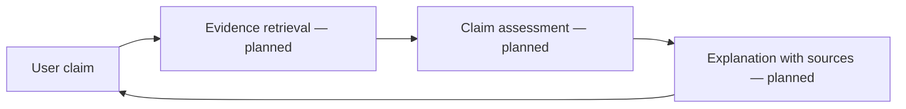

# FactGuard — Claim Verification Concept

<strong>A project concept for helping readers examine claims and understand why supporting evidence matters.</strong>

## Intended experience

The repository description frames FactGuard as a tool where a user submits a claim and receives a plain-language accuracy assessment. Responsible claim review should distinguish evidence from inference, cite sources, and show uncertainty rather than presenting a generated verdict as fact.

## Conceptual workflow

This is a **conceptual** diagram. The repository currently contains project copy and GitHub support files; application source, setup instructions, and an executable demo are not tracked here. There is no local run command yet.

## Published preview

[Open the FactGuard preview on Vercel](https://factguard-ai-claim-review.vercel.app/).

This Vercel site rehosts the publicly published OnSpace frontend build; it is not a deployment of the editable source project. The current preview produces illustrative scores in the browser and does not retrieve evidence or provide authoritative fact-checking. No app environment-variable values or backend source were available to transfer from OnSpace.

## Before presenting it as runnable

Add the application source, data/source-citation design, setup steps, and an evaluation plan. A claim-verification result needs visible references and clear uncertainty; it should not be treated as authoritative fact-checking without those safeguards.
